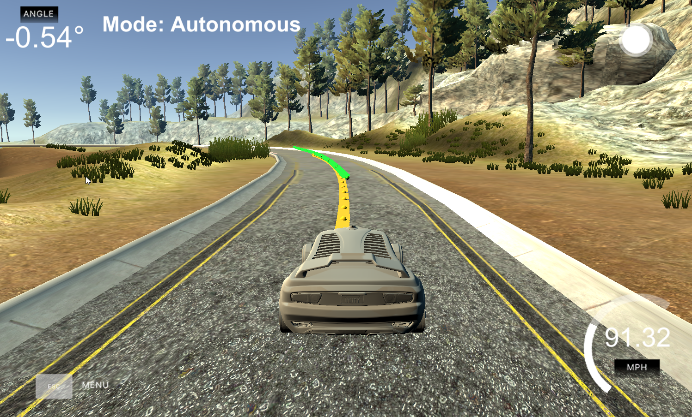

# CarND-Controls-MPC
This project is to fulfill the 5th project of Self-Driving Car Engineer Nanodegree Program Term 2. 
The objective is to buiild a Model Predictive Controller for driving the car in the simulated environments.

Simulated environment: 

## Model Predictive Controller (MPC)
The MPC is a model to find a optimal trajectory with lowest "objective" cost defined.
Same as traditional optimization problem, we need to define three elements
  1. Decision Variables
  2. Objective function
  3. Constraints (or the feasible region)
 ### Decision Variables
For decision variables, the obvious one are the current control variable i.e the steer and throttle.
However, as our objective function will consider the predictive value in a short future (says N). 
We will also create some dependent varibles, which are based on the current state and the current control variable, to describe the future predicted state.

### Objective function
For the objective function, we will include the Cross Track Error(cte) and Orientation Error(eψ). 
Also, to avoid stopping, we added a reference velocity to penalize the car with deviated speed. 
Finally, we would like to minimize the use of actuators and also the change of actuators across time. (Imaged that how dizzy you will be if you were in a car with a snack walk,)

However, the weighting factor for all these components had certain trade-off. But obviously, our major target is the first point, that is to reduce the error for the predicted trajectory.

### Constraints

Ideally, the only constraints should be the limitation of the control/actuators. However, as we also treat some initialized state(the current observation) as variables, we will also set these variables to the observed value.
The dependent variables are with nearly no constraints as it should be derived by the current state and the current control.

## Comparison to PID Controller
Compared to PID Controller, MPC Controller is much reliable as it can leverage some predicted future state for the error minimization.
PID controller can only consider the current errors(Cross track error and Orientation Error).

For parameter tuning, once the the parameter is basically set. It would be very easy to speed up the car to a wanted speed as we got the referenced velocity as part of our objective function.

The car can be pushed up to 91.3 MPH.

So in short, the parameter for MPC is more invariant with the speed while PID Controller is not.

